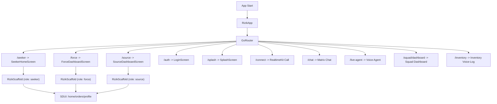

# Rizik App: Complete Visual Flow + Art/UI Design Spec

## 1) App Entry and Global Shell

### Runtime Entry Flow
1. `RizikApp` boots `MaterialApp.router` and binds `GoRouter`.
2. Router opens default route `/seeker` (current hardcoded initial route).
3. Role home routes (`/seeker`, `/force`, `/source`) all mount `RizikScaffold` with different `initialRole`.
4. `RizikScaffold` renders a layered cinematic shell and mounts SDUI pages (`home`, `orders`, `profile`).

### Core Files
- `/Users/sabbir/RizikV10/lib/app/rizik_app.dart`
- `/Users/sabbir/RizikV10/lib/routes.dart`
- `/Users/sabbir/RizikV10/lib/core/shell/rizik_scaffold.dart`
- `/Users/sabbir/RizikV10/lib/core/sdui/sdui_screen.dart`
- `/Users/sabbir/RizikV10/lib/data/remote/supabase/sdui_service.dart`

## 2) Global Navigation Map

## 3) Design System and Art Direction

### Visual Language
- Primary style: cinematic background + glassmorphism shell + floating AI orb.
- Layout identity: layered shell with fixed top bar + fixed bottom glass nav + center Mojo action node.
- Role-adaptive color behavior via `MorphEngine`.

### Color System
- Brand primary green: `#00A150`.
- Role accents:
  - Seeker: green family.
  - Force: blue family.
  - Source: amber family.
- Secondary accent in some UI zones: purple (`brandPurple`).

### Typography
- App-level text theme: `Hind Siliguri` (`GoogleFonts.hindSiliguriTextTheme()`) in app root.
- Specific surfaces use targeted fonts:
  - Top bar logo: `Poppins`.
  - Role sheet labels: `Hind Siliguri`.
  - Chat screen: `ShareTechMono` (Matrix style).

### Token/Theme Sources
- `/Users/sabbir/RizikV10/lib/core/theme/rizik_brand_colors.dart`
- `/Users/sabbir/RizikV10/lib/core/theme/rizik_theme.dart`
- `/Users/sabbir/RizikV10/lib/core/theme/morph_engine.dart`

## 4) Shell Artboard (Main Super-Screen)

### Layer Stack (top -> bottom)
1. `RizikGlassTopBar` (glass header with role pill, bell, avatar).
2. Body: SDUI viewport (`home`/`orders`/`profile`).
3. `DictationOverlay` (voice text overlay).
4. `RizikGlassNav` (2-action glass dock: Orders | Wallet).
5. `MojoFloatingWidget` (center floating orb).
6. `EdgeAnimations` (4-side ambient effects).
7. `CinematicVideoBackdrop` (video or gradient fallback).

### Shell Component Files
- `/Users/sabbir/RizikV10/lib/core/shell/rizik_scaffold.dart`
- `/Users/sabbir/RizikV10/lib/shared/widgets/headers/rizik_glass_top_bar.dart`
- `/Users/sabbir/RizikV10/lib/shared/widgets/navigation/rizik_glass_nav.dart`
- `/Users/sabbir/RizikV10/lib/core/ai/presentation/mojo_floating_widget.dart`
- `/Users/sabbir/RizikV10/lib/core/feed_ui/components/cinematic_video_backdrop.dart`

## 5) Screen-by-Screen Artboard Specs

### A) Role Home (Seeker / Force / Source)
- Route(s): `/seeker`, `/force`, `/source`
- Host: `RizikScaffold(initialRole: ...)`
- Content source: SDUI from Supabase by `(role, screenId)`.
- Default body state: `screenId = home`.
- Pull-to-refresh enabled in SDUI viewport.

#### Visual Structure
1. Top glass bar with role subtitle (`Seeker Mode`, `Force Mode`, `Source Mode`).
2. Dynamic middle feed driven by widget registry.
3. Bottom glass dock with two lateral actions + center Mojo orb.
4. Cinematic animated background under all content.

### B) Orders Surface
- Trigger: tap left nav action in glass dock.
- `screenId = orders` in SDUI.
- Same shell, swapped middle payload.

### C) Wallet/Profile Surface
- Trigger: tap right nav action in glass dock.
- `screenId = profile` in SDUI (currently used as wallet surface).
- Same shell, swapped middle payload.

### D) Role Switcher Sheet
- Trigger: tap `MojoFloatingWidget`.
- Modal with 3 role cards + quick action card.
- Role cards:
  - Seeker (`বাজার করুন`) green gradient.
  - Force (`আয় করুন`) blue gradient.
  - Source (`ব্যবসা করুন`) amber gradient.
- Quick action card: `Rizik Connect`.

File:
- `/Users/sabbir/RizikV10/lib/shared/widgets/navigation/role_switcher_orb.dart`

### E) Realtime Video/Audio Call (`/connect`)
- Initial state: pre-call panel with start/join logic.
- Runtime states:
  1. Initializing
  2. In-call with participant video tiles
  3. Error fallback message
- Controls: mic toggle, camera toggle, leave.

File:
- `/Users/sabbir/RizikV10/lib/features/connect/presentation/call_screen_realtimekit.dart`

### F) Squad Chat (`/chat`)
- Distinct visual mode: Matrix theme.
- Background: dark matrix + digital rain effect.
- Bubble style: neon green borders, terminal tone.
- Font: `ShareTechMono`.

File:
- `/Users/sabbir/RizikV10/lib/features/connect/presentation/screens/chat_screen.dart`

### G) Live Agent (`/live-agent`)
- Visual mode: clean white conversational assistant.
- Top status line: session health (`Connecting...`, active, error).
- Chat transcript list + bottom input composer.

File:
- `/Users/sabbir/RizikV10/lib/features/voice/presentation/live_agent_screen.dart`

### H) Squad Dashboard (`/squad/dashboard`)
- Hybrid screen:
  1. Native capacity toggle block (top).
  2. SDUI-rendered dashboard body (expanded).
- Supports app-bar colors from payload.

File:
- `/Users/sabbir/RizikV10/lib/features/squad/presentation/screens/squad_dashboard_screen.dart`

### I) Inventory Voice-Log (`/inventory`)
- Native utility screen for inventory command input.
- Structure:
  1. Instruction card.
  2. Voice/text command field with send action.
  3. AI response card.
  4. Recent updates list.

File:
- `/Users/sabbir/RizikV10/lib/features/source/inventory/presentation/screens/inventory_screen.dart`

## 6) SDUI Content Pipeline (Design Runtime)

### Runtime Chain
1. `SDUIScreen` requests `(role, screenId)` payload.
2. `SduiService` fetches `app_screens.screen_data` from Supabase.
3. `RizikRenderer` receives root node.
4. `WidgetRegistry` maps `type -> widget builder`.
5. Visual tree renders directly inside shell viewport.

### Why This Matters for Design
- Shell is stable brand identity.
- Middle canvas is server-driven and can be redesigned without app release.
- Enables role-personalized art direction by payload.

## 7) Artboard Checklist for Figma / Design Handoff

1. Create base frame: 390x844 (mobile) and 430x932 (large mobile).
2. Build shell component set:
- TopGlassBar
- CinematicBackdrop
- EdgeAnimations
- SDUICanvas
- GlassNav2Action
- MojoOrb
3. Build variant set by role:
- Seeker
- Force
- Source
4. Build route-specific boards:
- Connect Call
- Matrix Chat
- Live Agent
- Squad Dashboard
- Inventory Voice-Log
5. Define motion states:
- nav left/right activation
- role switch sheet open/close
- call init -> join
- SDUI loading/error/retry

## 8) Current Gaps (Implementation vs Spec)

1. Auth is bypassed right now in router redirect.
2. Some deep routes are placeholders (`/auth/otp`, `/force/gig/:id`, `/seeker/order/:id`).
3. Theme usage is partially mixed (`RizikTheme`, direct colors, and legacy tokens coexist).
4. Bottom navigation systems coexist (`RizikGlassNav` and older `RizikBottomNav` style files).

## 9) Next Visual Upgrade Plan

1. Consolidate to one nav system (`RizikGlassNav`) and retire legacy nav widgets.
2. Move all screen color usage to `RizikBrandColors` + role tokens.
3. Standardize font strategy per surface (shell vs tactical screens).
4. Create SDUI widget style constraints (spacing, radii, elevation, color tokens) to keep server-driven screens brand-consistent.

## 10) 4-Directional Live Payload Contract

`RizikScaffold` now supports dynamic feed surfaces from `app_screens`:
- primary: `(role, 'feed_surfaces')` with keys `center`, `left`, `right`
- fallback: `(role, 'feed_center'|'feed_left'|'feed_right')` with `items`

Center card item contract:
- `title` (string)
- `subtitle` (string)
- `icon` (string key: `work|delivery|skill|store|inventory|profit|play|ride|squad|wallet|earnings|khata|chat|control`)
- `colors` (array of hex colors)
- `actionLabel` or `action_label` (string)
- `actionRoute` or `action_route` (string route)

Side card item contract:
- `title` (string)
- `icon` (string key)
- `route` (string route)
- `metric_key` or `metricKey` (optional stable key for runtime binding)
- `value` or `metric_value` (optional badge value)
- `label` or `metric_label` (optional helper line)

Refresh behavior:
- shell auto-refreshes feed surfaces every ~25s, so backend payload changes appear without app restart.
- side cards are additionally hydrated with local runtime providers (orders/wallet/squads/inventory), so metric badges stay live even when SDUI payload labels remain static.
- runtime hydration prioritizes `metric_key` match; title-based matching is only fallback for backward compatibility.
- current live keys in shell mapping include:
  `chat_unread_count`, `squad_alerts`, `squad_count`, `active_orders`, `wallet_balance`, `low_stock_count`, `net_profit_est`, `rider_earnings_est`.

Seed migration added:
- `/Users/sabbir/RizikV10/supabase/migrations/20260214070000_feed_surfaces_sdui.sql`
